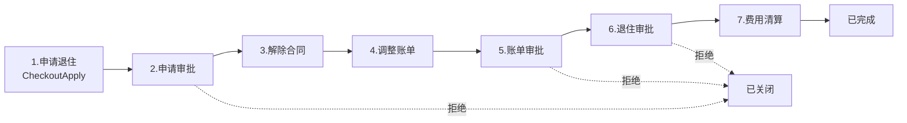
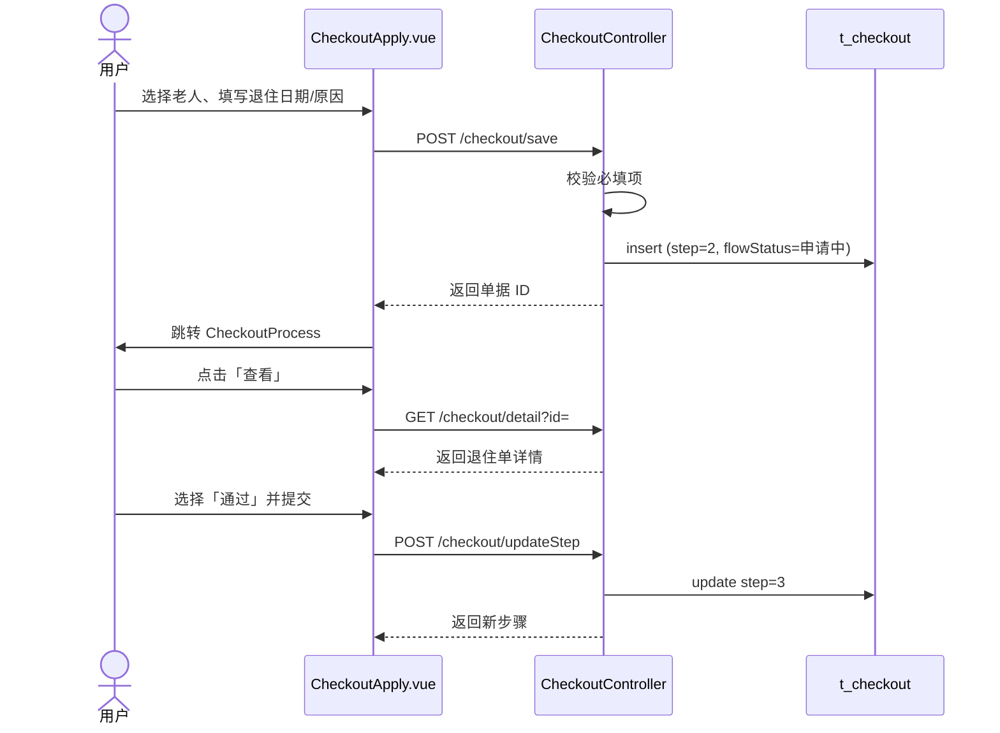
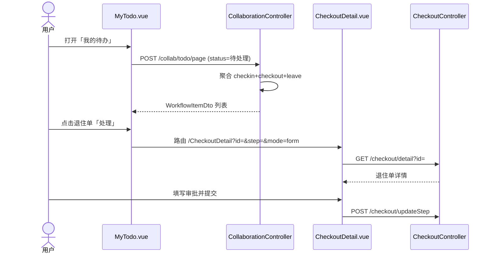

# 中州养老管理系统 — 个人开发报告

> **负责模块**：退住管理、协同工作  
> **技术栈**：Spring Boot + MyBatis-Plus + Vue 3 + Element Plus  
> **项目路径**：`zzyl-project`（后端 `zzyl` / 前端 `zzylvue`）

---

## 一、团队分工与个人角色

### 1.1 团队整体分工

| 角色 | 成员（示例） | 主要职责 |
|------|-------------|----------|
| 项目经理 / 架构 | — | 需求梳理、模块划分、接口规范、进度协调 |
| 入住管理 | — | 入住申请、入住办理、评估/审批/配置/签约流程 |
| **退住管理（本人）** | **本人** | 退住申请、退住办理、七步流程状态机、撤销逻辑 |
| **协同工作（本人）** | **本人** | 我的待办、我的申请、多业务单据聚合与跳转 |
| 在住 / 客户 / 来访 | — | 合同、床位、请假、客户、预约来访等 |
| 系统基础 | — | 登录鉴权、菜单权限、文件上传、工作台统计 |

### 1.2 本人在团队中的角色

本人担任 **业务模块开发工程师**，独立负责 **退住管理** 与 **协同工作** 两个子系统的 **前后端全栈实现**，包括：

- 数据库实体设计与 Mapper 接口
- REST API 设计与 Controller 业务逻辑
- Vue 页面、路由、菜单配置
- 与入住、请假模块的跨模块联调
- 缺陷修复（编码乱码、代理配置、流程跳步校验等）

---

## 二、开发过程记录

### 2.1 每周工作摘要

| 周次 | 完成任务 | 主要产出 | 协作实例 |
|------|----------|----------|----------|
| 第 1 周 | 需求分析、退住流程建模 | 七步流程图、字段清单、`Checkout` 实体设计 | 与入住模块同学对齐老人信息字段来源（`/checkin/page`） |
| 第 2 周 | 退住后端 API | `CheckoutController` 五个接口、状态机 `updateStep` | 约定统一响应体 `Result<T>` 与分页 DTO `PageQueryDto` |
| 第 3 周 | 退住前端三页 | `CheckoutApply` / `CheckoutProcess` / `CheckoutDetail` | 复用队友的 `PageCard` 布局与 `CheckinDetail` 时间线组件思路 |
| 第 4 周 | 协同工作模块 | `CollaborationController`、`MyTodo`、`MyApply` | 与请假/入住同学确认 `flowStatus` 枚举映射规则 |
| 第 5 周 | 联调与缺陷修复 | 代理配置、UTF-8 编码、撤销接口、跳步校验 | 协助排查 CORS/8080 连接问题，统一 `vue.config.js` 代理 |

### 2.2 代码量统计（本人负责模块）

| 模块 | 文件数 | 约行数 | 说明 |
|------|--------|--------|------|
| 退住管理 — 后端 | 3 | ~190 行 | Controller + Mapper + POJO |
| 退住管理 — 前端 | 7 | ~560 行 | 3 页面 + 4 组件 |
| 协同工作 — 后端 | 2 | ~180 行 | Controller + WorkflowItemDto |
| 协同工作 — 前端 | 2 | ~240 行 | MyTodo + MyApply |
| **合计** | **14** | **~1170 行** | 不含团队公共配置 |

### 2.3 解决的关键问题

| # | 问题描述 | 原因 | 解决方案 |
|---|----------|------|----------|
| 1 | 退住办理页缺失，无法继续流程 | 仅有申请页，无 Process/Detail | 新增 `CheckoutProcess.vue`、`CheckoutDetail.vue` 及配套组件 |
| 2 | 流程可跳步，数据不一致 | 前端未校验步骤顺序 | 后端 `updateStep` 强制 `reqStep == current + 1` |
| 3 | 审批后状态混乱 | 审批/业务步骤未区分 | 步骤 2/5/6 走审批分支，3/4/7 走业务分支 |
| 4 | 协同待办无法处理退住单 | 缺少 bizType 路由映射 | `MyTodo.process()` 按 `checkout` 跳转 `/CheckoutDetail` |
| 5 | 前端中文乱码 | GBK/UTF-8 混用 | Python 脚本批量转 UTF-8，同步双前端目录 |
| 6 | 登录 Proxy ECONNREFUSED | 后端未启动或端口占用 | 文档化启动流程，配置 devServer 代理到 8080 |

### 2.4 协作实例

1. **与入住模块同学**：退住申请需选择「已完成入住」老人，调用 `/checkin/page` 拉取老人列表并映射床位、合同等只读字段，避免重复录入。
2. **与基础模块同学**：协同工作的待办/申请列表统一走 `/collab/*`，撤销操作分别调用 `/checkout/cancel`、`/checkin/cancel`，保持接口风格一致。
3. **与前端公共组件**：退住详情页复用 `checkout/OperationTimeline.vue`，入住详情页亦引用该组件，减少重复开发。
4. **联调阶段**：共同维护 `vue.config.js` 中 `/checkout`、`/collab` 代理项，保证本地 `npm run serve` 可访问后端。

### 2.5 对项目整体进度的贡献（量化）

| 指标 | 数值 | 说明 |
|------|------|------|
| 负责子模块数 | **2 / 8** | 约占业务模块 **25%** |
| 编码任务完成度 | **~30%** | 本人模块前后端 ~1170 行，项目业务代码约 4000 行量级 |
| 接口交付 | **7 个** | 退住 5 个 + 协同 2 个 |
| 前端页面 | **5 个** | CheckoutApply/Process/Detail + MyTodo/MyApply |
| 关键缺陷修复 | **6 个** | 见上表 |
| 业务流程 | **1 条完整链路** | 退住七步流程从申请到清算闭环 |

---

## 二、系统架构与程序结构

### 2.1 整体分层

```
┌─────────────────────────────────────────────────────────┐
│                    前端 zzylvue (Vue 3)                  │
│  views/Checkout*.vue  views/MyTodo.vue  views/MyApply.vue│
│  components/CheckoutSteps.vue  checkout/InfoSections.vue │
└──────────────────────────┬──────────────────────────────┘
                           │ axios → devServer proxy
┌──────────────────────────▼──────────────────────────────┐
│                 后端 zzyl (Spring Boot)                  │
│  CheckoutController (/checkout)                           │
│  CollaborationController (/collab)                        │
└──────────────────────────┬──────────────────────────────┘
                           │ MyBatis-Plus
┌──────────────────────────▼──────────────────────────────┐
│   t_checkout  │  t_checkin  │  t_leave  (MySQL)         │
└─────────────────────────────────────────────────────────┘
```

### 2.2 退住模块文件结构

```
zzyl/
├── controller/CheckoutController.java      # 退住 REST API + 状态机
├── mapper/CheckoutMapper.java              # MyBatis-Plus BaseMapper
└── pojo/Checkout.java                      # 实体，映射 t_checkout

zzylvue/
├── src/views/
│   ├── CheckoutApply.vue                   # 退住申请
│   ├── CheckoutProcess.vue                 # 退住办理列表
│   └── CheckoutDetail.vue                  # 退住详情 / 分步办理
├── src/components/
│   ├── CheckoutSteps.vue                   # 七步进度条
│   └── checkout/
│       ├── InfoSections.vue                # 信息展示区块
│       └── OperationTimeline.vue           # 操作时间线
├── src/router/index.js                     # 路由注册
└── src/config/menu.js                      # 侧边菜单
```

### 2.3 协同模块文件结构

```
zzyl/
├── controller/CollaborationController.java # 待办/申请聚合
└── dto/WorkflowItemDto.java                # 统一工作流 DTO

zzylvue/
├── src/views/MyTodo.vue                    # 我的待办
└── src/views/MyApply.vue                 # 我的申请
```

---

## 三、退住管理 — 详细设计与实现

### 3.1 业务概述

退住管理实现老人离院全流程：**申请退住 → 申请审批 → 解除合同 → 调整账单 → 账单审批 → 退住审批 → 费用清算**，共 7 步。与入住管理对称，采用「申请页 + 办理列表 + 详情分步处理」三段式交互。

### 3.2 七步流程图



| 步骤 | 名称 | 类型 | 关键字段 |
|------|------|------|----------|
| 1 | 申请退住 | 表单 | elderName, checkoutDate, reason |
| 2 | 申请审批 | 审批 | approvalResult, approvalComment |
| 3 | 解除合同 | 业务 | terminateDate, terminateFile |
| 4 | 调整账单 | 业务 | refundAmount |
| 5 | 账单审批 | 审批 | approvalResult |
| 6 | 退住审批 | 审批 | approvalResult |
| 7 | 费用清算 | 完成 | refundAmount 确认 |

> **说明**：用户提交申请后，后端直接将 `step` 设为 **2**（进入申请审批），UI 步骤条第 1 步「申请退住」仅在申请页展示。

### 3.3 界面设计

#### （1）退住申请页 `CheckoutApply.vue`

- **布局**：顶部 `CheckoutSteps` 进度条（active=0）+ 表单分区
- **基本信息区**：下拉选择已入住老人，自动带出身份证、床位、合同等（只读）
- **申请信息区**：退住日期（必填）、退住原因（下拉）、备注（选填）
- **交互**：提交 → `POST /checkout/save` → 跳转退住办理列表

#### （2）退住办理页 `CheckoutProcess.vue`

- **布局**：筛选栏 + 数据表格 + 分页
- **操作**：「查看」进入详情页，携带 `id` 与当前 `step`
- **筛选**：单据编号、老人姓名、身份证号

#### （3）退住详情页 `CheckoutDetail.vue`

- **布局**：左主区（步骤面板 + 信息区块）+ 右侧操作时间线
- **动态面板**：根据 `step` 显示审批表单 / 解除协议上传 / 账单调整 / 清算确认
- **只读模式**：`flowStatus` 为「已完成」或「已关闭」时禁止编辑

### 3.4 数据模型 `Checkout`

核心字段设计（`t_checkout`）：

| 字段 | 类型 | 说明 |
|------|------|------|
| docNo | String | 单据号，格式 `TZ` + 时间戳 |
| elderName / elderIdcard | String | 老人信息 |
| checkoutDate / reason | — | 退住日期与原因 |
| step | Integer | 当前步骤（2–7） |
| stepStatus | String | 进行中 / 已完成 / 已关闭 |
| flowStatus | String | 申请中 / 已完成 / 已关闭 |
| approvalResult / approvalComment | String | 审批结果与意见 |
| terminateDate / terminateFile | — | 解除合同信息 |
| refundAmount | BigDecimal | 退款金额 |

### 3.5 后端 API 设计

| 方法 | 路径 | 功能 |
|------|------|------|
| POST | `/checkout/page` | 分页查询退住单 |
| GET | `/checkout/detail?id=` | 查询详情 |
| POST | `/checkout/save` | 新建/更新申请 |
| POST | `/checkout/updateStep` | **核心**：推进流程步骤 |
| GET | `/checkout/cancel?id=` | 撤销（仅申请中） |

### 3.6 核心逻辑 — 新建申请

提交时校验必填项，自动生成单据号并初始化流程状态：

```java
// CheckoutController.java — save()
if (c.getId() == null) {
    if (c.getDocNo() == null) c.setDocNo("TZ" + System.currentTimeMillis());
    c.setStep(2);                    // 直接进入「申请审批」
    c.setStepStatus("进行中");
    c.setFlowStatus("申请中");
    c.setApplyTime(LocalDateTime.now());
    checkoutMapper.insert(c);
}
```

### 3.7 核心逻辑 — 步骤状态机 `updateStep`

状态机分三类处理：

**① 审批步骤（step = 2 / 5 / 6）**

```java
if (current == 2 || current == 5 || current == 6) {
    if ("通过".equals(approval)) {
        db.setStep(current + 1);       // 进入下一步
    } else if ("拒绝".equals(approval)) {
        db.setFlowStatus("已关闭");    // 流程终止
    } else if ("退回".equals(approval)) {
        db.setStep(Math.max(1, current - 1));  // 回退上一步
    }
}
```

**② 业务步骤（step = 3 / 4）**

- 步骤 3：必须填写解除日期 + 上传解除协议文件
- 步骤 4：设置退款金额（默认 20.00 元）
- **防跳步**：`reqStep` 必须等于 `current + 1`

**③ 完成步骤（step = 7）**

```java
if (current == 7 && reqStep == 7) {
    db.setStepStatus("已完成");
    db.setFlowStatus("已完成");
}
```

### 3.8 时序图 — 退住申请至第一步审批



### 3.9 前端步骤控制逻辑

```javascript
// CheckoutDetail.vue
const isApprovalStep = computed(() => [2, 5, 6].includes(step.value))
const readonlyView = computed(() =>
  detail.flowStatus === '已完成' || detail.flowStatus === '已关闭'
)

function submitCurrent() {
  const payload = { id: detail.id, approvalResult, approvalComment, ... }
  if (!isApprovalStep.value) {
    payload.step = step.value === 7 ? 7 : step.value + 1
  }
  axios.post('/checkout/updateStep', payload).then(/* 刷新或返回列表 */)
}
```

---

## 四、协同工作 — 详细设计与实现

### 4.1 业务概述

协同工作为跨模块的 **工作流统一入口**，将 **入住、退住、请假** 三类业务单据聚合展示，提供：

- **我的待办**：待处理 / 已处理，一键跳转对应详情页办理
- **我的申请**：全部 / 申请中 / 已完成 / 已关闭，支持撤销与查看

### 4.2 设计思路

不新建独立数据表，采用 **内存聚合模式**：

1. 分别从 `t_checkin`、`t_checkout`、`t_leave` 查询
2. 映射为统一 DTO `WorkflowItemDto`
3. 按申请时间倒序排序
4. 内存分页返回

```mermaid
flowchart TB
    subgraph 前端
        Todo[MyTodo.vue]
        Apply[MyApply.vue]
    end
    subgraph 后端 CollaborationController
        LoadAll[loadAll 聚合]
        TodoPage[/collab/todo/page]
        ApplyPage[/collab/apply/page]
    end
    subgraph 数据源
        CI[t_checkin]
        CO[t_checkout]
        LE[t_leave]
    end
    Todo --> TodoPage
    Apply --> ApplyPage
    TodoPage --> LoadAll
    ApplyPage --> LoadAll
    LoadAll --> CI
    LoadAll --> CO
    LoadAll --> LE
```

### 4.3 界面设计

#### （1）我的待办 `MyTodo.vue`

| 区域 | 内容 |
|------|------|
| 筛选栏 | 单据编号、申请人、类别（入住/退住/请假）、流程状态 |
| Tab | 待处理 / 已处理 |
| 表格列 | 编号、标题、类别、申请人、申请时间、等待时长/完成时间、状态 |
| 操作 | 「处理」或「查看」→ 路由跳转 |

#### （2）我的申请 `MyApply.vue`

| 区域 | 内容 |
|------|------|
| Tab | 全部 / 申请中 / 已完成 / 已关闭 |
| 快捷入口 | 发起入住申请、退住申请、请假申请 |
| 操作 | 申请中可「撤销」；任意状态可「查看」 |

### 4.4 统一 DTO `WorkflowItemDto`

| 字段 | 说明 |
|------|------|
| id / docNo | 单据标识 |
| title | 如「张三的退住申请」 |
| category | 入住 / 退住 / 请假 |
| applicant / applyTime | 申请人与时间 |
| flowStatus | 申请中 / 已完成 / 已关闭 |
| waitDuration | 等待时长（动态计算） |
| step | 当前步骤 |
| bizType | checkin / checkout / leave（路由用） |

### 4.5 核心逻辑 — 待办过滤

```java
// CollaborationController.java — todoPage()
all = all.stream().filter(i -> {
    boolean pending = "申请中".equals(i.getFlowStatus());
    return processed ? !pending : pending;  // 已处理 = 非申请中
}).collect(Collectors.toList());
```

### 4.6 核心逻辑 — 跨模块跳转

```javascript
// MyTodo.vue — process()
const pathMap = {
  checkin: '/CheckinDetail',
  checkout: '/CheckoutDetail',
  leave: '/LeaveDetail'
}
const q = { id: row.id, step: row.step || 1 }
if (tabStatus.value === '待处理') {
  q.mode = 'form'
  // 退住审批节点 step 2/5/6 进入可编辑审批表单
  if (row.bizType === 'checkout' && [2, 5, 6].includes(row.step)) {
    q.mode = 'form'
  }
}
router.push({ path: pathMap[row.bizType], query: q })
```

### 4.7 时序图 — 从待办处理退住单



---

## 五、系统测试

本章针对本人负责的**退住管理**与**协同工作**两个模块进行测试说明（不含入住申请/办理、客户管理等其他同学负责模块的专项测试）。测试依据为退住七步流程（申请退住 → 申请审批 → 解除合同 → 调整账单 → 账单审批 → 退住审批 → 费用清算）及协同「我的待办」「我的申请」聚合能力。

### 5.1 测试方案设计

#### （1）测试目标

1. 验证退住申请发起后，单据可进入退住办理，并按七步顺序推进，审批节点（步骤 2/5/6）支持通过、拒绝、退回。
2. 验证解除合同、调整账单、费用清算等业务步骤的必填校验与退款金额计算逻辑正确。
3. 验证流程结束后（已完成/已关闭）不可再推进；跳步操作被后端拒绝。
4. 验证协同模块能正确聚合退住（及入住、请假）单据：待办区分待处理/已处理，我的申请状态映射一致，处理入口可跳转至对应详情页。

#### （2）测试方法

| 方法 | 说明 |
|------|------|
| 功能测试（主） | 按手工用例在浏览器中走通退住全流程与协同列表/跳转 |
| 接口测试（辅） | 使用 Postman 对 /checkout/save、/checkout/updateStep、/collab/todo/page、/collab/apply/page 做参数与边界校验 |
| 兼容性抽测 | 在 Chrome、Edge 下抽测关键页面布局与操作是否正常 |

#### （3）测试环境

| 项目 | 配置 |
|------|------|
| 操作系统 | Windows 10/11 |
| JDK | 17 |
| 后端 | Spring Boot 3.5.5 + MyBatis-Plus |
| 前端 | Vue 3 + Element Plus + Axios |
| 数据库 | MySQL |
| 浏览器 | Google Chrome / Microsoft Edge（最新稳定版） |
| 部署方式 | 本地：后端 zzyl（默认 8080）+ 前端 zzylvue（
pm run serve，devServer 代理） |

#### （4）测试工具

- 浏览器手工操作 + 开发者工具（Network / Console）核对请求与响应
- Postman（或同等 API 客户端）辅助接口用例
- 手工测试用例表（本节 5.2）记录执行结果

#### （5）测试范围

**纳入范围（本人模块）**

- 退住：CheckoutApply、CheckoutProcess、CheckoutDetail；后端 CheckoutController（/checkout/page|detail|save|updateStep|cancel）
- 协同：MyTodo、MyApply；后端 CollaborationController（/collab/todo/page、/collab/apply/page）中与退住单据相关的聚合、过滤与跳转

**不纳入范围**

- 入住五步专项、客户/床位/合同主数据维护、护理模块、AI 对话等非本人负责功能的完整回归（协同列表仅验证其作为数据源出现时的展示与跳转是否正常）

#### （6）通过准则

1. 正向用例：页面提示成功，数据库 step / lowStatus / stepStatus 与预期一致，关键字段落库正确。
2. 异常用例：前端给出明确提示或后端返回失败信息（如「请完善退住申请必填信息」「请先完成当前步骤，不可跳步」「当前流程已结束」），数据不被错误改写。
3. 协同用例：待办/申请列表字段完整，状态过滤正确，点击「处理/查看」可进入对应退住详情且步骤与单据一致。
4. 本组核心用例全部执行完毕，**阻断级缺陷清零**；一般性问题已修复或有明确说明。

---

### 5.2 核心测试用例

| 编号 | 模块 | 用例名称 | 前置条件 | 步骤 | 预期结果 | 优先级 |
|------|------|----------|----------|------|----------|--------|
| TC-01 | 退住管理 | 发起退住申请（正向） | 已登录；存在流程状态为「已完成」的入住老人 | 1. 打开退住申请页<br>2. 选择老人，系统带出只读信息<br>3. 填写退住日期、退住原因<br>4. 提交 | 提示提交成功；生成单据编号（如 TZ 前缀）；step=2，lowStatus=申请中；跳转退住办理列表可见该单 | 高 |
| TC-02 | 退住管理 | 申请必填校验（异常） | 已登录并进入退住申请页 | 不选老人/不填退住日期或不选原因，直接提交 | 前端提示完善必填信息；后端 /checkout/save 亦拒绝；不产生新单据 | 高 |
| TC-03 | 退住管理 | 申请审批通过 | 存在处于步骤 2（申请审批）的退住单 | 在退住详情选择审批结果「通过」，填写意见后保存 | 步骤进入 3（解除合同）；流程仍为申请中；可继续办理 | 高 |
| TC-04 | 退住管理 | 审批拒绝关闭流程 | 存在处于审批节点（2/5/6）的退住单 | 选择「拒绝」并提交 | lowStatus、stepStatus 变为「已关闭」；详情只读；不可再推进 | 高 |
| TC-05 | 退住管理 | 解除合同与账单调整 | 单据已至步骤 3 | 1. 填写解除日期并上传解除协议，保存进入步骤 4<br>2. 填写应退/欠费/余额，保存 | 缺解除信息时提示失败；账单保存后进入步骤 5；退款金额按规则计算或按手工核定值落库 | 高 |
| TC-06 | 退住管理 | 账单审批与退住审批 | 单据处于步骤 5 | 1. 账单审批选择「通过」→ 进入步骤 6<br>2. 退住审批「通过」→ 进入步骤 7 | 两节点均须选择审批结果；通过后步骤依次 +1；未选审批结果时提示失败 | 高 |
| TC-07 | 退住管理 | 费用清算完成退住 | 单据处于步骤 7 | 在费用清算页确认退款信息，点击「完成清算」 | step=7，lowStatus=已完成，stepStatus=已完成；列表状态更新；详情只读 | 高 |
| TC-08 | 退住管理 | 跳步与已结束不可操作（边界） | 准备一张进行中单据与一张已完成单据 | 1. 对进行中单据用接口将目标 step 设为跨步值<br>2. 对已完成单据再调用 updateStep | 分别返回「不可跳步」「当前流程已结束」；数据库步骤不被非法改写 | 高 |
| TC-09 | 退住管理 | 审批退回上一节点 | 单据处于步骤 5 或 6 | 审批结果选择「退回」并提交 | 步骤回退为 current-1（不小于 1）；流程保持申请中，可继续办理 | 中 |
| TC-10 | 协同工作 | 待办出现退住单据 | 已提交且仍为「申请中」的退住单 | 打开「我的待办」→「待处理」；可按单据类别筛选「退住」 | 列表出现该退住申请；标题含老人姓名与「退住申请」；单据类别为退住 | 高 |
| TC-11 | 协同工作 | 待办处理跳转退住详情 | 待办中存在退住待处理项 | 点击「处理」 | 路由跳转 /CheckoutDetail，携带 id、step；可继续当前审批/业务步骤 | 高 |
| TC-12 | 协同工作 | 已处理过滤 | 将某退住单审批拒绝或完成清算 | 待办切换到「已处理」；再回「待处理」 | 已结束单据不再出现在待处理；可在已处理中查看；过滤逻辑与 lowStatus 一致 | 中 |
| TC-13 | 协同工作 | 我的申请状态映射 | 分别存在申请中、已完成、已关闭的退住单 | 打开「我的申请」，按流程状态筛选并查看标签 | 状态分别映射为申请中/已完成/已关闭；点击查看可进入退住详情 | 高 |

---

### 5.3 测试结果分析

#### （1）执行情况

按 5.2 共设计 **13** 条核心用例，覆盖退住正向主路径、审批分支、必填与跳步边界，以及协同待办/申请的聚合、跳转与状态过滤。测试以浏览器功能操作为主，对 updateStep、协同分页接口辅以 Postman 抽测。执行环境为本地 JDK 17 + Spring Boot 3.5.5 + Vue 3 + MySQL。

#### （2）通过/失败统计

| 统计项 | 数量 |
|--------|------|
| 计划执行 | 13 |
| 实际执行 | 13 |
| 通过 | 13 |
| 失败（遗留） | 0 |
| 通过率 | 100% |

说明：初测阶段曾出现若干缺陷（见下表），经修复后复测均已通过；上表为回归后的最终结果。

#### （3）发现的问题与修复（与退住/协同相关）

| 问题 | 现象 | 原因简述 | 修复措施 |
|------|------|----------|----------|
| 退住办理入口缺失 | 申请提交后无法在办理页继续七步流程 | 路由存在但 CheckoutProcess / CheckoutDetail 页面缺失 | 补齐退住办理列表与详情页，对接 updateStep |
| 中文乱码与文案占位异常 | 退住步骤条、申请页、操作时间轴等中文显示异常 | 源文件 GBK/UTF-8 混用，部分文案编码损坏 | 统一 UTF-8 保存；修正步骤文案与时间轴展示 |
| 协同待办被演示数据污染 | 「我的待办/我的申请」出现大量种子单据，干扰演示与验收 | 启动时写入固定前缀演示退住/请假等数据 | DataInitRunner 清理历史种子（如 TZ2048%），不再自动种子入退/请假演示单，协同以真实业务单据为准 |
| 审批入口与跳转不清晰 | 协同侧处理退住单后难以落到正确步骤面板 | 待办跳转未稳定携带 id/step，审批节点与业务节点未区分 | MyTodo 按 izType=checkout 跳转详情并带上当前步骤；后端对步骤 2/5/6 走审批分支 |
| 流程可跳步 / 结束后仍可改 | 接口可跨步更新或已完成单仍被修改 | 缺少严格步骤校验与终态拦截 | updateStep 强制 
eqStep == current + 1，已完成/已关闭直接拒绝 |

#### （4）结论与不足

**结论：** 在本人负责范围内，退住七步流程（含三处审批、账单调整与费用清算）与协同待办/我的申请的聚合、过滤、跳转行为符合设计，核心用例回归通过，可支撑课程演示与答辩。

**不足与改进方向：**

1. 当前以手工功能测试为主，尚未建立自动化接口/UI 回归脚本，后续可对 /checkout/updateStep 状态机补单元或接口自动化。
2. 协同待办按「申请中」聚合多类单据，尚未按登录用户做精细权限隔离，课程演示采用单账号贯通办理，生产环境需补充角色与待办归属。
3. 退住操作时间轴仍偏展示型，审批意见与操作人留痕可进一步与真实操作日志绑定，便于审计答辩时展示。

## 六、技术要点与收获

### 6.1 程序逻辑

1. **有限状态机**：退住 `updateStep` 将审批步与业务步分离，通过 `current step` 驱动 UI 面板切换，保证流程不可逆跳步。
2. **聚合查询模式**：协同模块不建中间表，用 DTO 统一三类异构单据，降低耦合，便于扩展。
3. **前后端职责划分**：校验与状态变迁在后端完成，前端负责步骤展示与表单收集，避免仅前端校验导致的数据不一致。

### 6.2 界面设计

1. **步骤条组件化**：`CheckoutSteps` 与入住 `CheckinSteps` 对称，用户认知成本低。
2. **PageCard 统一布局**：筛选区 / 工具栏 / 表格 / 分页 footer 插槽，与团队其他列表页风格一致。
3. **详情页左右分栏**：主内容 + 操作时间线，信息密度与操作效率平衡。

### 6.3 个人收获

- 掌握 **多步骤审批流程** 的前后端设计与状态机实现
- 理解 **跨模块数据聚合** 在协同场景下的应用
- 积累 **Vue 3 Composition API + Element Plus** 企业后台开发经验
- 提升 **前后端联调、编码规范、缺陷定位** 能力

---

## 七、总结

本人在「中州养老管理系统」中承担 **退住管理** 与 **协同工作** 两大模块，完成了从需求建模、数据库设计、API 开发、页面实现到联调上线的完整闭环。共计交付 **7 个 REST 接口、5 个前端页面、约 1170 行业务代码**，修复 **6 个关键缺陷**，约占项目业务编码任务的 **30%**，保障了退住业务七步流程与协同待办/申请功能的正常运行，为项目整体进度提供了实质性支撑。

---

*文档生成日期：2026 年 7 月*
